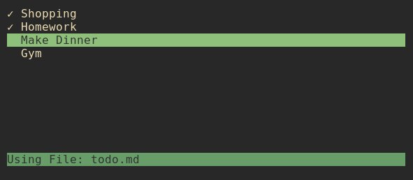

# Themis - a todo list for your terminal



## Install
```shell
git clone https://github.com/einzigartigername/themis.git
cd themis
cabal install
```

## Usage
Themis will look in the current folder for a `todo.md` file. If not found, it will use/create one in your home directory.

### Arguments:
`todo [ARGUMENT] [OPTION]`
* `-c`: use current directory
* `-d`: use home directory
* `-f FILE`: use FILE
* `-h`: display help dialog

If file does not exist, `todo` will create one.

### Default Keybinds
* `Up` or `k` - Up
* `Down` or `j` - Down
* Movement Keys + `Shift` - move selected item up/down in list
* `i` - insert above selected item
* `a` - insert below selected item
* Insert Keys + `Shift` - insert item at Top/Bottom of list
* `e` - edit selected item
* `c` - toggle check
* `d` - delete selected item
* `q` or `Esc` - quit application
* `h` - help panel with list of keybindings

In Item Editor: 
* `Esc` - quit edit mode (changes not saved)
* `Enter` - save changes / insert item

In Help Panel:
* `q` - quit help

### Config
If you want to change the keybinds or colors used, you can apply those changes in `~/.config/themis/config`.

Here a little example of the structure:
```ini
[color]
; Comment
; Colors are available as the ISO names, their bright variation and using hex values. 
selectionBG = magenta 
selectionFG = #3333ff

[keybinds]
insert = i
insertTop = shift + i
```
For a full list of available options, have a look at [example/config](example/config). All options are listed with there default values.

**Note**: Default list movement is only shadowed by config. If no  other binding for same key, default bindings will still be useable. 

**Note**: RGB Values are lossy, there are only 240 colors supported